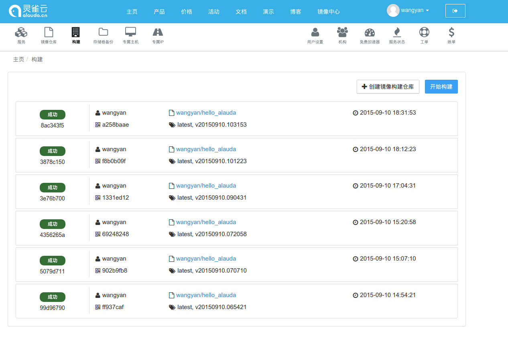
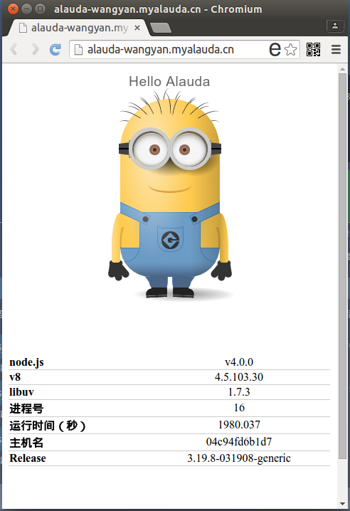

# Node.JS 4.0.0，灵雀云和 OneAPM 的整合测试

### 关于

> Node.JS 4.0.0 稳定版刚刚推出，备受期待，迫不及待地想用它写点东西; 此外，要把 Demo 放到 Internet 上得有一个公网 IP ，看到灵雀云挺不错的
> 还提供域名解析，简直业界良心，其实早就想试试它的 CaaS（Container-as-a-Service 容器即服务）了，对于一个单点应用一个 Dockerfile 就
> 足够了；OneAPM 则是一款性能监控的 SaaS 产品，支不支持 Node.JS 4.0.0 不是特别确定，接着这个机会刚好也拉出来溜溜。

### 建立一个 Demo 应用

[访问灵雀云上的版本点这里](http://alauda-wangyan.myalauda.cn/)


Demo 应用主要包括：

- 主体是某个[歪果仁](http://codepen.io/rachel_web/pen/pjzowB)用纯 CSS3 写的小黄人
- 使用 jQuery 给它加上一点点交互，这样小黄人身上的部位就可以被点击
- 使用 Node.JS 4.0.0 + Express 作为服务器
- 点击某个部位的时候会发送 AJAX 请求到后端， 然后请求被 Express 相应的路由接受并返回
- TODO: 使用 Redis 统计每个部位的点击数

## 创建代码库

即本 Repo ，要保证根目录下需要有一个[Dockerfile](https://github.com/wyvernnot/hello_alauda/blob/master/Dockerfile)，来看看每一行的含义：

1\. `Docker` 环境使用 Node.JS 4.0.0 非常简单，一行搞定

```
FROM node:4.0.0
```

2\. 加上维护者信息

```
MAINTAINER wyvernnot wyvernnot@users.noreply.github.com
```

3\. 拷贝文件进 `Docker` 镜像，安装 `NPM` 依赖

```
COPY . .
RUN npm install
```

4\. 配置环境变量，暴露端口，和启动应用

```
EXPOSE 8888
ENV ONEAPM_APP_NAME awesome_app
ENV ONEAPM_DEMO 1
ENV ONEAPM_LICENSE_KEY <YOUR_KEY>
ENV ONEAPM_LOG stdout
ENV ONEAPM_LOG_LEVEL trace
ENV ONEAPM_NO_CONFIG_FILE 1
CMD ["npm","start"]
```

## 新建镜像构建仓库

新建构建仓库的时候需要提供一个代码仓库下载连接，灵雀云在后台根据这里填的连接去抓代码。


## 开始构建

镜像仓库和镜像构建仓库的不同就在与这个 `构建` 的过程。你可以随时从 Gihub 上的最新（或指定）版本创建新的构建，构建完便得到新的一个镜像。



从图上也可以看出，每个镜像除了有自己的 `Image ID`，还对应GIT的提交号，实际上你还可以指定分支来实现灰度发布。

## 查看镜像列表

这是构建仓库所有镜像的列表，此时你已经可以放心的下载到本地环境运行，并且可以随意切换不同的镜像版本。


重要的事情说三遍：

放心地下载到本地运行。

放心地下载到本地运行。

放心地下载到本地运行。

这就是容器的魅力：

- 开发和测试用的是一毛一样的环境
- 不会再遇到 `在我机器上是好的吖` 这种扯皮的事情
- 发布的时候可以直接发布这个镜像
- 并发一下子上来了也不要紧，动动鼠标加几个实例，省时省力

## 基于镜像创建服务

使用灵雀云，你可以非常方便地通过镜像创建 Web 服务。


你的服务会被自动分配一个域名，并且打开了 80 端口，从浏览器里访问:



## 添加监控

灵雀云本身已经能够提供非常基础的监控。想知道网站访问量，响应时间，用户网络分布等则需要安装 OneAPM 探针。
从 `v1.2.8` 版本开始，OneAPM 探针的安装已经和 Node.JS 其它模块的安装没有区别了。

```sh
npm install oneapm --save
```

要特别感谢`死月`等一大批用户坚持不懈的建（tu）议（cao）！ 

**监控CPU/内存**

灵雀云和 OneAPM 都提供了服务 CPU 和内存的监控，数据还算比较吻合。

灵雀云


OneAPM


**监控吞吐量**

由于基因的不同，OneAPM 和 灵雀云对吞吐量的关注点略有不同，从下图可以看出来。

灵雀云


OneAPM


OneAPM 的视角是自顶向下的，能够细分不同请求的吞吐量，响应时间，错误率等等，功能非常多。
而灵雀云的监控则是自底向上的，对流量的监控是整体的，并且精确到了字节。

## 总结

- 灵雀云和 OneAPM 都能很好的支持 Node.JS 4.0.0 应用
- 灵雀云上使用 OneAPM 的 Node.JS 探针 只需要在 `Dockerfile` 里加上 `ONEAPM_*` 环境变量
- 灵雀云和 OneAPM 监控的视角不一样，配合使用效果最佳
